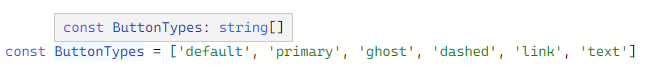
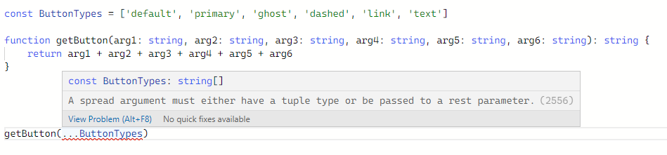
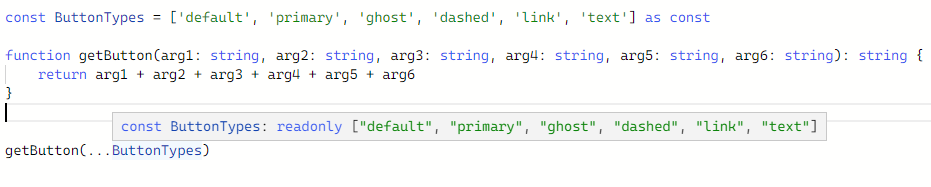

#### 断言

类型断言可以手动指定一个值的类型

**类型断言不能称之为类型转换，是因为转换意味着某种运行时的支持**

类型断言纯粹是编译时语法，为编译器通过提供关于如何分析代码的方法，有两种形式:

1. “尖括号”语法：`<类型>值`
2. as 语法：`值 as 类型`


``` ts

let someValue: any = 'this is a string'

let strLength: number = (<string>someValue).length

let strLengthAgain: number = (someValue as string).length

```

#### 双重断言

就如第二个例子所示，如果直接给 event 断言成HTMLElement 就会报错
而使用了双重断言，编译器就不会报错

``` ts
function handler(event: Event) {
    const mouseEvent = event as MouseEvent;
}

function handlerAgain(event: Event) {
    const element = (event as any) as HTMLElement
}

```


#### 非空断言

具体而言，`x!` 将从 x 值域中排除 `null` 和 `undefined` 
需要注意的是：! 非空断言操作符会从编译阶段生成的 `JavaScript` 代码中移除


``` ts
// 忽略 undefined 和 null 类型
function myFunc(maybeString: undefined | null) {
    let value: string = maybeString!
    console.log(value)
}

// 调用函数时忽略 undefined 类型
type NumGenerator = () => number
function getValue(numGenerator: NumGenerator | undefined) {
    const number: number = numGenerator!()
}

let falg: null | undefined | string
flag!.toString()

```

#### const 断言

`as const` 被称为 `const 断言`。在 `TypeScript` 中使用 `as const` 时，我们可以将对象的属性或数组的元素设置为只读，向语言表明表达式中的类型不会被扩大。

举例：

```typescript
const ButtonTypes = ['default', 'primary', 'ghost', 'dashed', 'link', 'text']
```

  


我们可以看到 `ButtonTypes` 已经被编译器推断成了 `string[]` 类型。这是一个由 0 或者更多 string 类型组成的可变数组。此时将 `ButtonTypes` 传入一些固定参数的方法时就会报错，如：

  


如果我们对 `ButtonTypes` 使用了 `as const` 断言就会：

- 该表达式中的字面类型不应被扩展（例如：不能从“hello”转换为字符串）
- 对象字面量获取只读属性
- 数组文字成为只读元组

  

我们可以看到 `ButtonTypes` 变成了只读元组，因此 `TypeScript` 可以确保其内容不会在其声明和函数调用之间发生变化。


#### 赋值断言

即允许在实例属性和变量声明后面放置一个!号，从而告诉 `TypeScript` 该属性会被明确地赋值。

```ts
let name!: string
```

