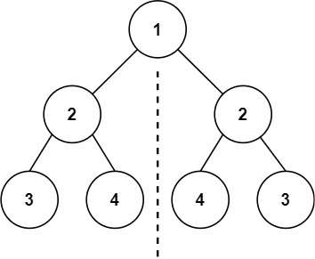

### 对称二叉树

描述：

给你一个二叉树的根节点 `root` ， 检查它是否轴对称。

示例：



```js
输入：root = [1,2,2,3,4,4,3]
输出：true
```


```js
输入：root = [1,2,2,null,3,null,3]
输出：false
```

#### 解题思路

我们首先要清楚，判断对称二叉树要比较的是哪两个节点，要比较的可不是左右节点

其实我们要比较的是两个树（这两个数是根节点的左右子树），所以在递归遍历的过程中，也要同时遍历两棵树


#### 实现

**递归判断是否为对称二叉树**

```js
/**
 * Definition for a binary tree node.
 * function TreeNode(val, left, right) {
 *     this.val = (val===undefined ? 0 : val)
 *     this.left = (left===undefined ? null : left)
 *     this.right = (right===undefined ? null : right)
 * }
 */
/**
 * @param {TreeNode} root
 * @return {boolean}
 */
var isSymmetric = function(root) {
  const compareNode = function(left, right) {
    // 当有一侧的为 null 时，直接比较左右子树
    if(left == null || right == null) return left == right
    // 左子树的左节点和右子树的右节点比较，左子树的右节点和右子树的左节点比较
    return (left.val == right.val && compareNode(left.left, right.right) && compareNode(left.right, right.left))
  }

  if(root == null) return true
  
  return compareNode(root.left, root.right)
};
```