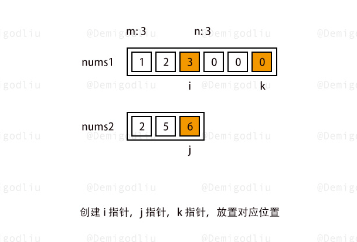

### 合并两个有序数组

描述：

给你两个按 非递减顺序 排列的整数数组 nums1 和 nums2，另有两个整数 m 和 n ，分别表示 nums1 和 nums2 中的元素数目。

请你 合并 nums2 到 nums1 中，使合并后的数组同样按 非递减顺序 排列。

注意：最终，合并后数组不应由函数返回，而是存储在数组 nums1 中。为了应对这种情况，nums1 的初始长度为 m + n，其中前 m 个元素表示应合并的元素，后 n 个元素为 0 ，应忽略。nums2 的长度为 n 。

#### 解题思路

所以，我们总共需要创建三个指针，两个指针用于指向 nums1 和 nums2 的初始化元素数量的末位，也就是分别指向 m−1 和 n-1 的位置，还有一个指针，我们指向 nums1 数组末位即可。

原地修改时，为了避免从前往后遍历导致原有数组元素被破坏掉，我们要选择从后往前遍历！

  


#### 实现

```js
/**
 * @param {number[]} nums1
 * @param {number} m
 * @param {number[]} nums2
 * @param {number} n
 * @return {void} Do not return anything, modify nums1 in-place instead.
 */
var merge = function (nums1, m, nums2, n) {
  let i = m - 1, j = n - 1, k = m + n - 1;
  while (i >= 0 || j >= 0) {
    // 当 nums1 已经遍历完了 直接把 nums2 的值赋予 nums1
    if(i < 0) nums1[k--] = nums2[j--]
    else if(j < 0) nums1[k--] = nums1[i--]
    else if(nums1[i] < nums2[j]) nums1[k--] = nums2[j--]
    else nums1[k--] = nums1[i--]
  }
};
```