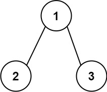
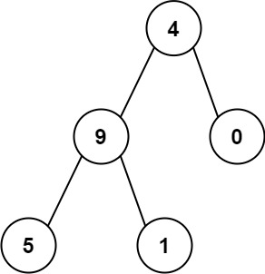

###  求根节点到叶节点数字之和

给你一个二叉树的根节点 root ，树中每个节点都存放有一个 0 到 9 之间的数字。
每条从根节点到叶节点的路径都代表一个数字：

- 例如，从根节点到叶节点的路径 1 -> 2 -> 3 表示数字 123 。
计算从根节点到叶节点生成的 所有数字之和 。

叶节点 是指没有子节点的节点。

  

示例:

```js
输入：root = [1,2,3]
输出：25
解释：
从根到叶子节点路径 1->2 代表数字 12
从根到叶子节点路径 1->3 代表数字 13
因此，数字总和 = 12 + 13 = 25
```

  


```js
输入：root = [4,9,0,5,1]
输出：1026
解释：
从根到叶子节点路径 4->9->5 代表数字 495
从根到叶子节点路径 4->9->1 代表数字 491
从根到叶子节点路径 4->0 代表数字 40
因此，数字总和 = 495 + 491 + 40 = 1026
```


#### 解题思路

用回溯法

#### 实现


```js
/**
 * @param {TreeNode} root
 * @return {number}
 */
var sumNumbers = function (root) {
  let res = 0
  function dfs(node, path) {
    if (!node) return
    path = path + node.val
    if (!node.left && !node.right) {
      res += Number(path)
    }
    dfs(node.left, path);
    dfs(node.right, path);
  }
  dfs(root, '');
  return res;
};
```