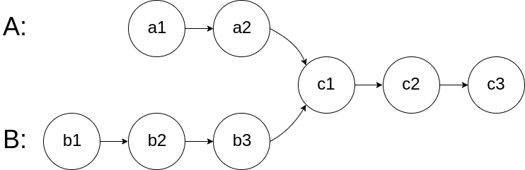
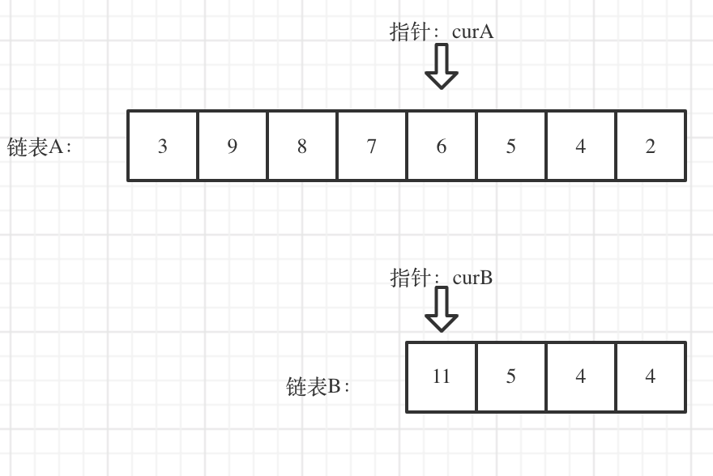

###  链表相交

描述：

给你两个单链表的头节点 headA 和 headB ，请你找出并返回两个单链表相交的起始节点。如果两个链表没有交点，返回 null 。

图示两个链表在节点 c1 开始相交：

  

题目数据 保证 整个链式结构中不存在环。

注意，函数返回结果后，链表必须 **保持其原始结构** 。

示例：

  


```js
输入：intersectVal = 8, listA = [4,1,8,4,5], listB = [5,0,1,8,4,5], skipA = 2, skipB = 3
输出：Intersected at '8'
解释：相交节点的值为 8 （注意，如果两个链表相交则不能为 0）。
从各自的表头开始算起，链表 A 为 [4,1,8,4,5]，链表 B 为 [5,0,1,8,4,5]。
在 A 中，相交节点前有 2 个节点；在 B 中，相交节点前有 3 个节点。
```


  

```js
输入：intersectVal = 8, listA = [4,1,8,4,5], listB = [5,0,1,8,4,5], skipA = 2, skipB = 3
输出：Intersected at '8'
解释：相交节点的值为 8 （注意，如果两个链表相交则不能为 0）。
从各自的表头开始算起，链表 A 为 [4,1,8,4,5]，链表 B 为 [5,0,1,8,4,5]。
在 A 中，相交节点前有 2 个节点；在 B 中，相交节点前有 3 个节点。
```

#### 解题思路

1、指针相等，需要把两个链表尾部对齐
2、对齐之后，较长链表多出来的部分是不可能产生相交节点的，遍历节点移除这部分
3、同时遍历两个链表，相等就返回，停止遍历，否则一直遍历到最后返回 null

  


#### 实现

```js
/**
 * @param {ListNode} headA
 * @param {ListNode} headB
 * @return {ListNode}
 */
var getIntersectionNode = function (headA, headB) {
  // 定义获取一个链表的长度的方法
  const getListLen = function (head) {
      if (!head) return 0
      let cur = head
      let len = 1
      while (cur.next) {
          len++
          cur = cur.next
      }
      return len
  }

  let lenA = getListLen(headA)
  let lenB = getListLen(headB)
  let curA = headA, curB = headB;

  // 保证 curA 去遍历长的链表
  if (lenA < lenB) {
      [curA, curB] = [curB, curA];
      [lenA, lenB] = [lenB, lenA];
  }
  let gap = lenA - lenB; // 计算链表长度差
  // 先移 A 链表使得两链表尾部对齐
  while (gap-- > 0) {
      curA = curA.next;
  }

  while (curA && curA != curB) {
      curA = curA.next
      curB = curB.next
  }
  return curA
};
```