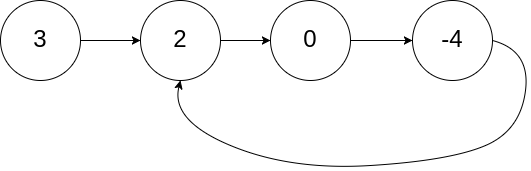

### 环形链表 II

描述：

给定一个链表的头节点 `head` ，返回链表开始入环的第一个节点。 如果链表无环，则返回 `null`。

如果链表中有某个节点，可以通过连续跟踪 next 指针再次到达，则链表中存在环。 为了表示给定链表中的环，评测系统内部使用整数 pos 来表示链表尾连接到链表中的位置（**索引从 0 开始**）。如果 pos 是 -1，则在该链表中没有环。注意：**pos 不作为参数进行传递**，仅仅是为了标识链表的实际情况。

**不允许修改** 链表。

示例：

  


```js
输入：head = [3,2,0,-4], pos = 1
输出：返回索引为 1 的链表节点
解释：链表中有一个环，其尾部连接到第二个节点。
```


#### 解题思路

使用**快慢指针**判断链表中是否有环

- 每当慢指针 slow 前进一步，快指针 fast 就前进两步。
- 如果 fast 最终遇到空指针，说明链表中没有环；
- 如果 fast 最终和 slow 相遇，那肯定是 fast 超过了 slow n 圈，说明链表中含有环。

  


- ● D：从头节点到入环点的距离
- ● S1：从入环点到首次相遇点的距离
- ● S2：从首次相遇点到入环点的距离
- 相遇时，慢指针走的距离：D + S1
- 相遇时快指针已经绕环 n 次，它走的距离：D + n(S1+S2) + S1
- 因为快指针的速度是 2 倍，所以相同时间走的距离也是 2 倍，也就是说D + n(S1+S2) + S1 = 2(D+S1)
- 上面的公式推导出 D = (n-1)(S1+S2) + S2
- 也就是说，从链接头结点到入环点的距离，等于从首次相遇点绕环n-1圈再回到入环点的距离


#### 实现

```js
// 判断是否链表中是否有环的方法
/**
 * @param {ListNode} head
 * @return {boolean}
 */
var hasCycle = function(head) {
  // 快慢指针初始化指向 head
  let slow = head;
  let fast = head;
  // 快指针走到末尾时停止
  while (fast && fast.next) {
    // 慢指针走一步，快指针走两步
    slow = slow.next;
    fast = fast.next.next;
    // 快慢指针相遇，说明含有环
    if (slow == fast) {
      return true;
    }
  }
  // 不包含环
  return false;
};
```

```js
/**
 * @param {ListNode} head
 * @return {ListNode}
 */
var detectCycle = function(head) {
  // 快慢指针初始化指向 head
  let slow = head;
  let fast = head;
  // 快指针走到末尾时停止
  while (fast && fast.next) {
    // 慢指针走一步，快指针走两步
    slow = slow.next;
    fast = fast.next.next;
    // 快慢指针相遇，说明含有环
    if (slow == fast) {
      // 任一一节点指向头节点
      fast = head;
      // 同步向前进
      while (fast != slow) {
        fast = fast.next;
        slow = slow.next;
      }
      // 返回入口节点
      return fast;
    }
  }
  // 不包含环
  return null;   
};
```


