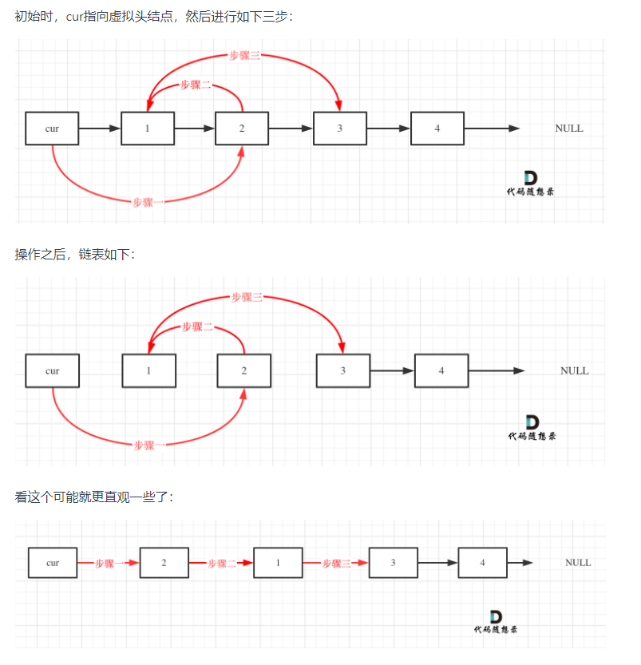

### 两两交换链表中的节点

描述：

给你一个链表，两两交换其中相邻的节点，并返回交换后链表的头节点。**你必须在不修改节点内部的值的情况下完成本题**（即，只能进行节点交换）。

示例：


```js
输入：head = [1,2,3,4]
输出：[2,1,4,3]
```

```js
输入：head = []
输出：[]
```

```js
输入：head = [1]
输出：[1]
```

#### 解题思路

这道题正常模拟就可以了

建议使用虚拟头节点

接下来就是交换相邻两个元素了，此时一定要画图，不画图，操作多个指针很容易乱，而且要操作的先后顺序




#### 实现
```js
/**
 * Definition for singly-linked list.
 * function ListNode(val, next) {
 *     this.val = (val===undefined ? 0 : val)
 *     this.next = (next===undefined ? null : next)
 * }
 */
/**
 * @param {ListNode} head
 * @return {ListNode}
 */
var swapPairs = function(head) {
  // 虚拟头节点
  let ret = new ListNode(0, head), temp = ret;
  // 保证有两个节点可以进行交换
  while(temp.next && temp.next.next) {
    let current = temp.next.next, pre = temp.next
    pre.next = current.next // 步骤三
    current.next = pre // 步骤二
    temp.next = current // 步骤一
    
    temp = pre
  }
  return ret.next
};
```